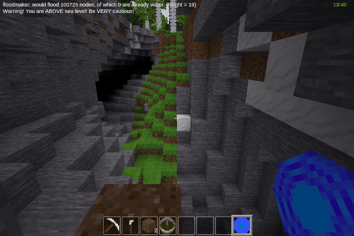
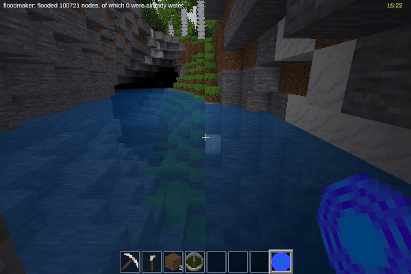

floodmaker
==========

Easily create floods—caution required!

By David G (kestral246@gmail.com)

Before:
------

After:
-----

Features
--------

- Right-click on a node to turn it into water, which then propagates through all adjacent air and water nodes, turning them into water_source nodes.
- Won't flood any nodes higher than the initial node.
- In regular mode, doesn't allow flooding above sea level.
- In pro mode, any elevations are allowed, but please be extremely cautious since it's very easy for catastrophic flooding when flooding above sea level.
- Only loaded mapchunks will get flooded, and may require getting close enough to actually flood entire area. May have to do multiple times to flood a large region like a really big undersea cavern.
- Maximum number of nodes flooded is currently set to 250000.
- Sea level is currently set to 1.
- Little error checking, it will scan through air and water until it hits maxcount.
- No crafting recipe.

To use (regular mode)
---------------------

- Regular mode when in creative mode, without worldedit.
- Only allows flooding at sea level or lower, to avoid catastrophic flooding.
- Point at node and right click to get summary of what would be flooded. A report of a large number of water nodes isn't necessarily a problem, since it can't flood above sea level.
- To flood, press sneak key while right-clicking.
- The node clicked will turn to water, and then the flood will propagate through all adjacent air and water nodes, but won't go any higher than the initial node.
- The number of flooded nodes is reported, which could be different from the original report, depending on mapgen blocks loaded and terrain changes between clicks.

To use (pro mode)
-----------------

- Pro mode when in creative mode, and with worldedit enabled.
- Allows flooding at any level. When above sea level, any paths to the sea or air can cause catastrophic flooding. Worldedit required, since that is what you'll need to repair any major mistakes.
- Point at node and right click to get summary of what would be flooded. If it reports a large number, double and triple check, to avoid catastrophic flooding.
- To flood when at sea level and below, it's the same as regular mode, press sneak key while right-clicking.
- To flood when above sea level, press sneak and aux keys while right-clicking.
- The node clicked will turn to water, and then the flood will propagate through all adjacent air and water nodes, but won't go any higher than the initial node.
- The number of flooded nodes is reported, which could be different from the original report, depending on mapgen blocks loaded and terrain changes between clicks.
