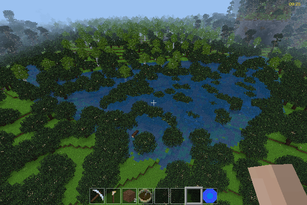

floodmaker
==========

Easily create floods—caution required!

By David G (kestral246@gmail.com)

Before:
------

After (intended):
----------------

After (unintended):
------------------
Full disclosure, after making the above screenshots, I discovered that I had accidentally flooded a good chunk of the forest below the cavern. Variable flood range has been added to help address this. I was able to repair this using worldedit replace function.

Features
--------

- Right-click on a node to turn it into water, which then propagates through all adjacent air and water nodes, turning them into water_source nodes.
- Won't flood any nodes higher than the initial node.
- Requires creative mode to use. Since it's very easy to cause catastrophic flooding when above sea level, this case also requires worldedit, so it's available to fix mistakes.
- Flood range selectable, currently between 20, 40, 60, 80, and unlimited.
- Only loaded mapchunks will get flooded, and may require getting close enough to actually flood entire area. May have to do multiple times to flood a large region like a really big undersea cavern.
- Maximum number of nodes flooded is currently set to 250000.
- Sea level is currently set to 1.
- Little error checking, it will scan through air and water until it hits maxcount.
- No crafting recipe.

To use
------

- Need to be in creative mode.
- Without worldedit, only allows flooding at sea level or lower, to avoid catastrophic flooding.
- With worldedit, allows flooding at any level. When above sea level, any paths to the sea or air can cause catastrophic flooding. Worldedit required, since that is what you'll need to repair any major mistakes.
- Flooding range changed using sneak left-click and sneak right-click. Currently supports 20, 40, 60, 80, or unlimited. The wear indicator has been co-opted to display current range.
- Point at node and right click to get summary of what would be flooded. If it reports a large number, consider reducing range to avoid catastrophic flooding.
- To flood, press sneak and aux keys while right-clicking.
- The node clicked will turn to water, and then the flood will propagate through all adjacent air and water nodes, but won't go any higher than the initial node.
- The number of flooded nodes is reported, which could be different from the original report, depending on mapgen blocks loaded and terrain changes between clicks.

